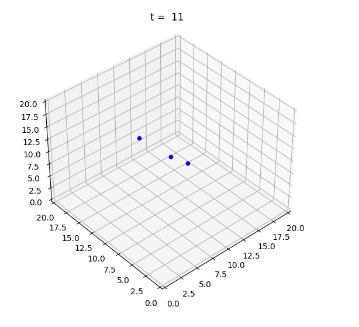
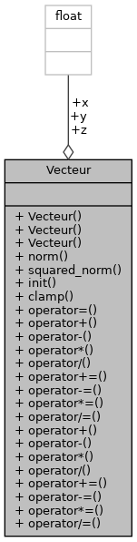
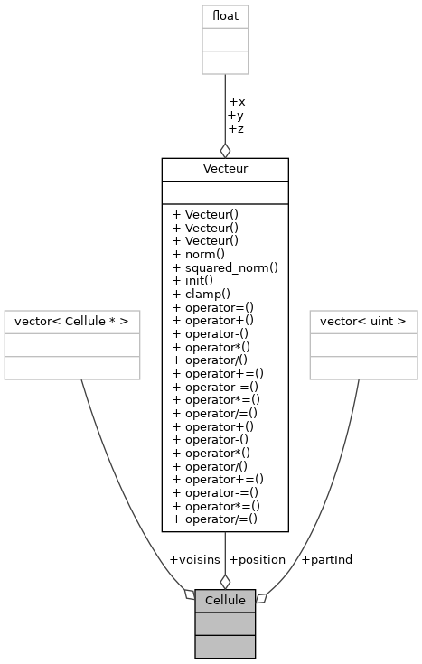
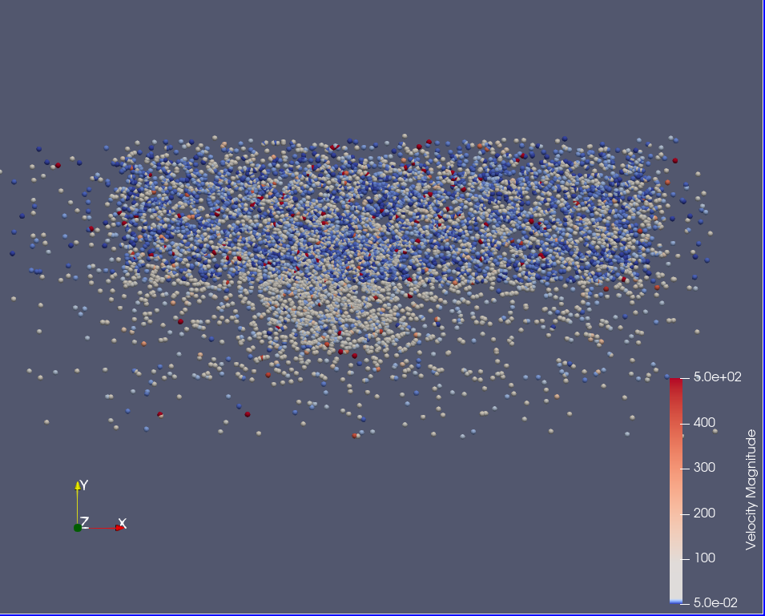
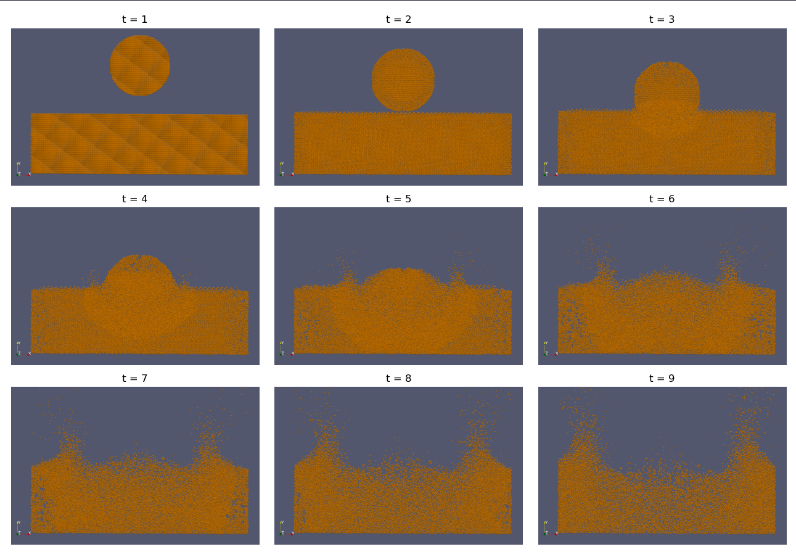

# Simulation de particules

Ce projet simule des particules soumises à des forces et des potentiels.


## Compilation &  éxécution

```bash
mkdir build && cd build
cmake ..
make
./particules
``` 

Création de fichiers VTK en sortie
```bash
./particules -nb_vtk=10
``` 

Documentation
```bash
make doc
``` 


## Lab 2

On test les performances de l'initialisation de  collections stockant notre classe de particules pour différents nombre de particules : $64, 128, . . . , 8192$ particules. 


| Particules | vector (ms) | list (ms) | deque (ms) | set (ms)   |
|------------|-------------|-----------|------------|------------|
| 64         | 0.008827    | 0.005821  | 0.001643   | 0.009377   |
| 128        | 0.007293    | 0.006352  | 0.006352   | 0.013957   |
| 256        | 0.020118    | 0.014397  | 0.008917   | 0.031690   |
| 512        | 0.026159    | 0.026110  | 0.017464   | 0.066626   |
| 1024       | 0.053140    | 0.051528  | 0.039124   | 0.117633   |
| 2048       | 0.103055    | 0.103977  | 0.093608   | 0.408374   |
| 4096       | 0.438431    | 0.458008  | 0.187725   | 0.552868   |
| 8192       | 0.469389    | 0.422621  | 0.371223   | 1.160390   |


A partir de $N = 2048$ les écarts en temps sont beaucoup plus marqués.

On choisis d'implémenter les particules dans un ```vector``` qui nous parait le choisi le plus logique étant donné que le nombre de particules restera fixe et que chaque particules aura un identifiant unique. De plus c'est une collection plutôt optimisée et flexible.

Après avoir implémenté l’algorithme de Strömer-Verlet pour la simulation des particules, on créer une simulation du système gravitationnel solaire, présent dans `demo/systeme_solaire.cxx`.

Nous avons programmé un petit programme python (`utils/visu.py`), qui affiche l'évolution de nos simulations au cours du temps, en prenant en entrée les données des positions des particules, permettant la visualisation de la simulation : 



Orbite de deux planètes autour du soleil.

## Lab 3

On implémente une classe vecteur représentant un vecteur en 3 dimensions.
Pour représenter les autres dimensions, on fait le choix de laisser les autres composantes à 0 pour simplifier le code.

La création d'un template ```Vecteur<dimension>``` aurait était possible, mais nous avons préféré de garder une structure fichier `.cxx/.hxx` pour un code plus clair et organisé, au lieu de tout définir dans les header comme les templates l'aurait obligé.




La compléxité de l'initialisation de l'Univers contenant les particules n'est pas particulièrement élevé.

Cependant, la complexité des intéractions entre les particules est très important au vu de la compléxité de Strömer-Verlet : $O(tn^2)$, pour $n=1000$ particules et $t=100$ pas de temps, on se retrouve avec $10^8$ calculs de forces à effectuer.

Le calcul de la racine carré (`std::sqrt(float)`) dans la force gravitationelle prend jusqu'à 30% du temps total d'exécution d'après gprof.

Pour diviser la complexité par deux, on utilise la relation $F_{i,j} = -F_{j,i}$ en itérant seulement sur les $j < i$.


## Lab 4

Pour optimiser les performances, on discrétise l'espace en une grille de cellules de longueur caractéristique $r_{cut}$, et on limite les interactions au voisinnage des cellules.




On définit aussi une nouvelle force à l'aide du potentiel de Lennard-Jones.

On créer aussi une simulation de collision entre deux objects, disponbible dans `demo/collision_1.cxx`.


Après ces optimisations le temps de calculs reste elevé, dans cette simulation : 

Pour $t=3900$ pas de temps, on obtient un temps d'éxécution de 10.8s.

On estime alors que pour $t=39 000$ pas de temps, comme il nous ai demandé de simuler dans le Lab4, le temps d'éxécution prendrais ~18 minutes.

D'après gprof le temps d'exécution viens majoritairement, de méthodes de vector, de méthodes de notre classe Vecteur ou du parcours des itérateurs : 

| Méthode                                   | % Temps total | Appels        |
|-------------------------------------------|---------------|---------------|
| Univers::calcForces()                     | 9.84%         | 4,001         |
| vector::end()                             | 9.06%         | 68,735,159    |
| iterator::constructor                     | 7.87%         | 138,725,932   |
| iterator::operator!=                      | 7.09%         | 85,213,816    |
| vector::begin()                           | 5.91%         | 68,858,040    |
| vector<Particule>::operator[]             | 5.51%         | 72,101,908    |
| Univers::StromerVerlet(float, float)      | 4.72%         | 1             |
| Vecteur::operator*(float)                 | 3.54%         | 20,775,778    |
| Vecteur::squared_norm()                   | 3.54%         | 17,326,621    |
| Vecteur::operator-(const Vecteur&) const  | 3.54%         | 17,326,621    |
| Vecteur::Vecteur(float, float, float)     | 3.15%         | 47,882,150    | 
| ... | 

Le temps d'éxécutions de chaque méthode est très faible mais leur nombre d'appels est très elevés, au final cela représente un pourcentage conséquent dans le temps total d'éxécution.

## Lab 5

### Tests

TODO : Parler des test


### Affichage de la simulation

On peut préciser en paramètre de compilation : 

```shell
./particules nb_vtu=10
```

avec ```nb_vtu > 2```, cette commande généra 10 fichiers VTK, à temps régulier, du début jusqu' à la fin de la la simulation, en appelant une méthode dans `VTKWriter.h` permettant d'écrire ces fichiers .

Ces fichiers pourront être ouvert avec Paraview et permettent la visualisation des particules dans la simulation.

Visualisation de la simulation `demo/collision_1.cpp` : 





## Lab 6

Les conditions aux limites sont choisissable via le constructeur de Univers :BOUND_REFLEXION, BOUND_ABSORPTION, BOUND_PERIODIC.

La condition de réfléxion est définitivement la plus conséquente en terme de calcul et de temps d'exécution. Pour éviter que les floats explosent lors du calcul du potentiel, on fixe une distance minimale  aux murs $r_{min}$ auquel la position de la particule est clamps.

Quand le pas de simulation est trop grand, les particules accumulent de la vitesse dans le potentiel de réfléxion et atteignent de très grandes vitesses qui les font rebondir d'un mur à un autre presque instantanément, donnant l'impression que certaines particules sont bloquées sur le mur. 


Visualisation de la simulation `demo/collision_2.cpp` : 



## Problèmes de la simulation

Utiliser des pas de temps elevé rend la simulation est beaucoup moins précise, des pas de temps trop élevé font explosé certaines valeurs ce qui mène à des comportements irréalistes dans la simulation, amplifié par l'utilisation de float pour stocké les valeurs.

Le fait d'avoir utiliser des Vecteurs avec 3 composantes meme pour représenter des vecteurs de dimensions inférieur (au lieu d'utiliser des template) coûte en performance, des conditions doivent être vérifier à chaque itérations.

La condition de réfléxion ne fonctionne pas très bien, comme mentionné précedemment.

Dans notre simulation nous n'avons pas eu le temps d'implémenter la limite de la divergence de la vitesse et un méchanisme de gestion d'erreur.